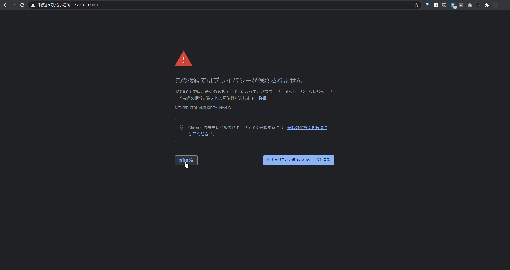
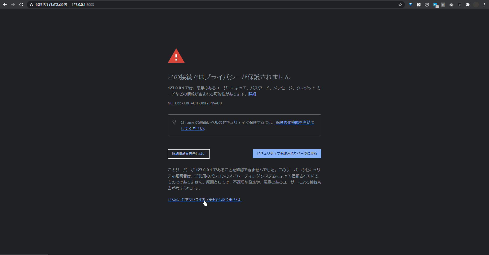

# Kantsu-server

Relay-Server for <a href="https://github.com/eiurur/Kantsu" target="_blank">Kantsu</a>

# Usage

## 1. Launch server.

### If you use docker

```sh
git clone https://github.com/eiurur/Kantsu-server.git
cd Kantsu-server
start.bat
```

and go to `https://127.0.0.1:15003`

### else

#### Required

- Node.js
- Redis

```sh
git clone https://github.com/eiurur/Kantsu-server.git
cd Kantsu-server
npm i
npm start
```

and go to `https://127.0.0.1:5003`


## 2. Enable requests to the server


Continue to click on the "More Info" button and click on the "Access 127.0.0.1" link.




**NOTE： `2. Enable requests to the server` is required every time you start the server.**
